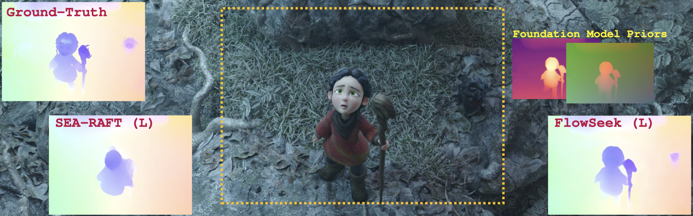

<h1 align="center"> FlowSeek: Optical Flow Made Easier with Depth Foundation Models and Motion Bases (ICCV 2025) </h1> 


<br>

:rotating_light: This repository contains download links to our dataset, code snippets, and trained deep stereo models of our work  "**FlowSeek: Optical Flow Made Easier with Depth Foundation Models and Motion Bases**",  [ICCV 2025](https://iccv.thecvf.com/)
 
by [Matteo Poggi](https://mattpoggi.github.io/)<sup>1</sup> and [Fabio Tosi](https://fabiotosi92.github.io/)<sup>1</sup>

University of Bologna<sup>1</sup>




<div class="alert alert-info">


<h2 align="center"> 

[Project Page](https://flowseek25.github.io/) | [Paper + Supplementary]([https://flowseek25.github.io/](https://arxiv.org/abs/2509.05297)) | [Poster](https://iccv.thecvf.com/media/PosterPDFs/ICCV%202025/1668.png?t=1756118189.8297398) 
</h2>

**Note**: 🚧 Kindly note that this repository is currently in the development phase. We are actively working to add and refine features and documentation. We apologize for any inconvenience caused by incomplete or missing elements and appreciate your patience as we work towards completion.

## :bookmark_tabs: Table of Contents

1. [Introduction](#clapper-introduction)
2. [Getting Started](#hammer_and_wrench-getting-started)
3. [Training](#gear-training)
4. [Testing](#rocket-testing)
5. [Qualitative Results](#art-qualitative-results)
6. [Contacts](#envelope-contacts)
7. [Acknowledgments](#pray-acknowledgements)

</div>

## :clapper: Introduction
We present FlowSeek, a novel framework for optical flow requiring minimal hardware resources for training. FlowSeek marries the latest advances on the design space of optical flow networks with cutting-edge single-image depth foundation models and classical low-dimensional motion parametrization, implementing a compact, yet accurate architecture. FlowSeek is trained on a single consumer-grade GPU, a hardware budget about 8× lower compared to most recent methods, and still achieves superior cross-dataset generalization on Sintel Final and KITTI, with a relative improvement of 10 and 15% over the previous state-of-the-art SEA-RAFT, as well as on Spring and LayeredFlow datasets.


<h4 align="center">

</h4>


**Contributions:** 

* We introduce **FlowSeek**, the first optical flow model that integrates a pre-trained **depth foundation model**. 

* We explore **different design strategies** to best exploit the prior knowledge of the foundation model for the optical flow estimation task.

* We develop **several variants** of FlowSeek, implementing different trade-offs between accuracy and efficiency, yet maintaining the **single-GPU requirement at training time**.


:fountain_pen: If you find this code useful in your research, please cite:

```bibtex
@InProceedings{Poggi_2025_ICCV,
    author    = {Poggi, Matteo and Tosi, Fabio},
    title     = {FlowSeek: Optical Flow Made Easier with Depth Foundation Models and Motion Bases},
    booktitle = {Proceedings of the International Conference on Computer Vision (ICCV)},
    year      = {2025},
}
```

<!-- ## :movie_camera: Watch Our Research Video!

<a href="https://youtu.be/m7dqHkxb4yg">
  
</a> -->

### :hammer_and_wrench: Getting Started

This code has been tested with nVIDIA Drivers version 550.54.14 and CUDA Libraries version 12.1.

1. **Dependencies**: Ensure that you have installed all the necessary dependencies. The list of dependencies can be found in the ```requirements.txt``` file.

2. **Download required datasets**: 
To evaluate/train FlowSeek, you will need to download the required datasets: [FlyingChairs](https://lmb.informatik.uni-freiburg.de/resources/datasets/FlyingChairs.en.html#flyingchairs), [FlyingThings3D](https://lmb.informatik.uni-freiburg.de/resources/datasets/SceneFlowDatasets.en.html), [Sintel](http://sintel.is.tue.mpg.de/), [KITTI](http://www.cvlibs.net/datasets/kitti/eval_scene_flow.php?benchmark=flow), [HD1K](http://hci-benchmark.iwr.uni-heidelberg.de/), [TartanAir](https://theairlab.org/tartanair-dataset/), and [Spring](https://spring-benchmark.org/).
By default `datasets.py` will search for the datasets in the locations pointed by the config file ```configs/datapaths.py```. You can edit the file with the proper paths in your file system

4. **Download pre-trained models**:
You can download Depth Anything v2 pre-trained weights (and ours) by running

```
bash scripts/get_weights.sh
```

## :gear: Training

You can train FlowSeek by setting the variable ```SIZE``` either to T or M inside ```scripts/train.sh```, and then run

```shell
bash scripts/train.sh
```

## :rocket: Testing

You can evaluate our pre-trained models by simply running

```shell
bash scripts/eval.sh
```

or you can evaluate your own checkpoint ``$checkpoint`` by running

```
python evaluate.py --cfg config/eval/flowseek-[T,S,M,L].json --model $checkpoint --dataset [sintel, kitti, spring, layeredflow]
```

## :art: Qualitative Results

You can reproduce the qualitative results from either the main paper or the supplementary material by running

```
bash scripts/qualitatives.sh
```

## :envelope: Contacts

For questions, please send an email to m.poggi@unibo.it or fabio.tosi5@unibo.it


## :pray: Acknowledgements

We would like to extend our sincere appreciation to the authors of the following projects for making their code available, which we have utilized in our work:

- We would like to thank the authors of [SEA-RAFT](https://github.com/JiaRenChang/PSMNet) and [Depth Anything v2](https://github.com/DepthAnything/Depth-Anything-V2) for providing their code, which has been instrumental to implement FlowSeek

- We would also like to thanks the authors of [DPT](https://github.com/isl-org/DPT), [Depth Anything](https://github.com/LiheYoung/Depth-Anything), [FlowFormer](https://github.com/drinkingcoder/FlowFormer-Official) and [CRAFT](https://github.com/askerlee/craft) for providing their code, which has been instrumental in our ablation studies.
